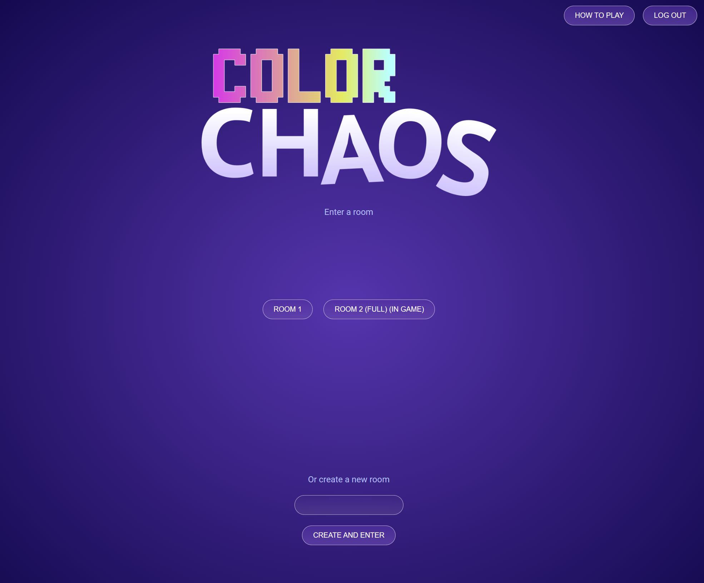
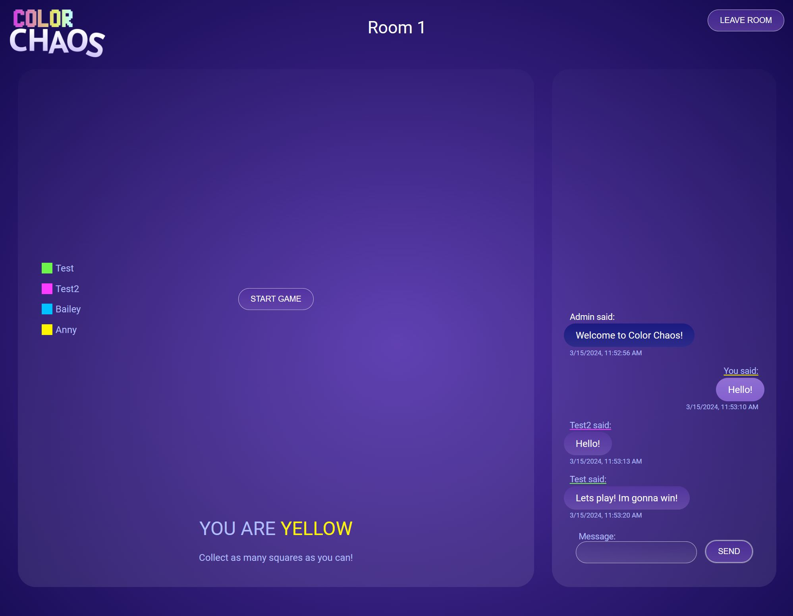
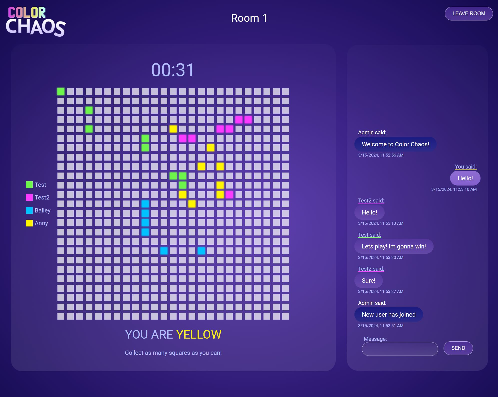
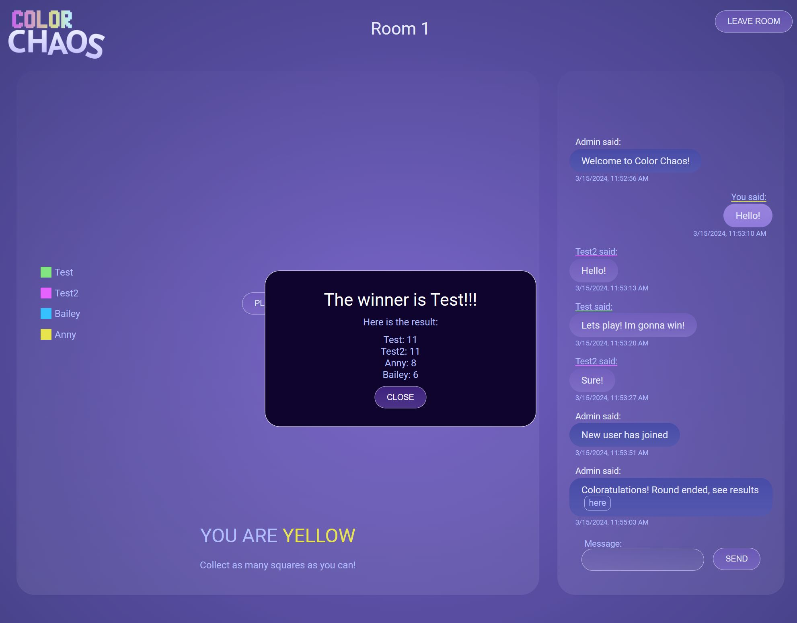
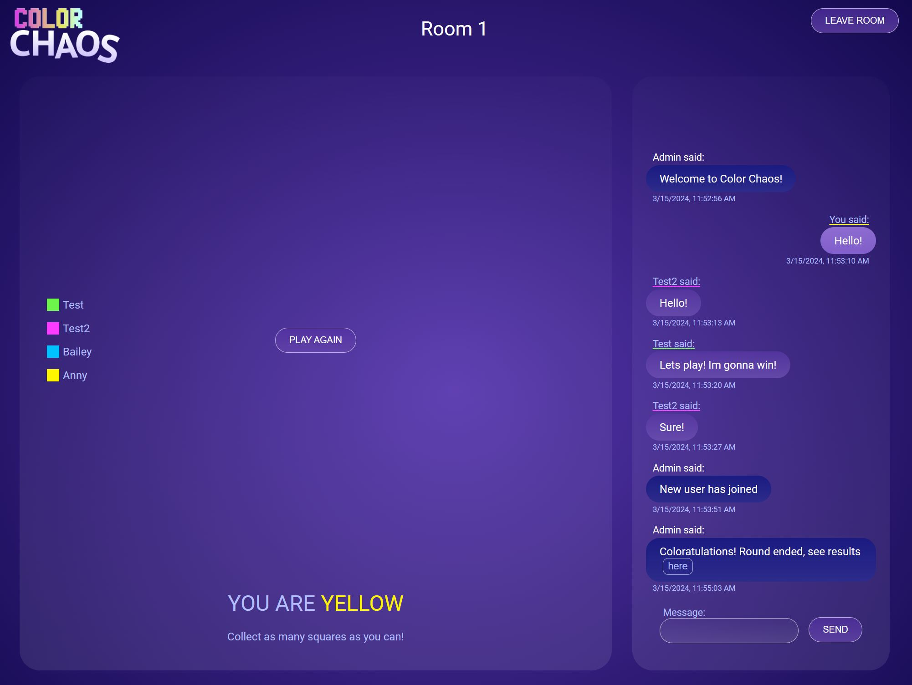
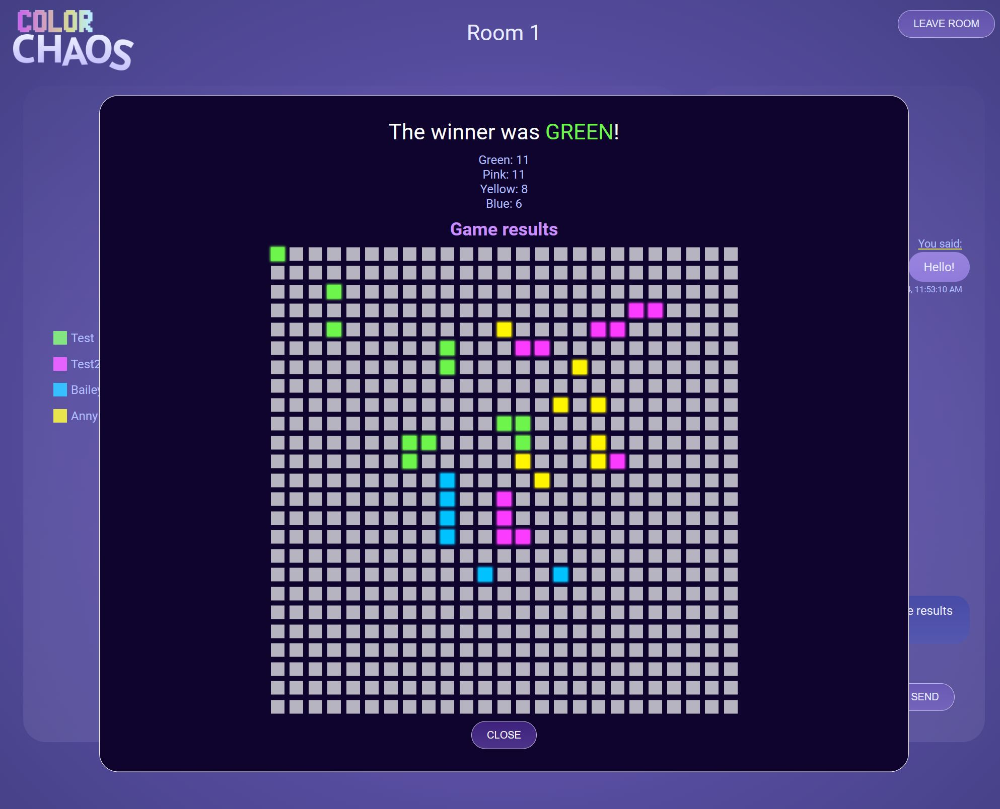

# Color Chaos

Color Chaos is an online multiplayer game where players compete to color the most cells on a grid within a given time limit. This README provides an overview of the game, its features, and instructions for running the client and server.

## Gameplay Overview

- Upon visiting the page, users must either log in or register as a new user.
- After authentication, users can either join existing rooms or create new ones.
- Each room has a live chat feature where users can communicate with each other.
- The game requires a minimum of 2 players and a maximum of 4 players.
- Once the game starts, players have 3 seconds to prepare before the grid appears.
- Players must click on cells on the grid to color them within the time limit.
- At the end of the game, the player with the most colored cells wins.

## Repository Structure

The repository has two main folders:

1. **client**: This folder contains the frontend code responsible for rendering the game interface and handling user interactions.
2. **server**: In this folder, you'll find the backend code that manages the game's logic, including the chat feature and game mechanics.

The client folder uses `socket.io-client` to establish a connection with the server's `socket.io`. This connection allows real-time communication between the client and server, enabling features like live chat and game synchronization.

## Technologies and Dependencies

### Client
- HTML
- Vite
- SCSS
- JavaScript
- socket.io-client

### Server
- Node.js
- Express.js
- cors
- crypto-js
- dotenv
- mysql2
- socket.io

## Setup Instructions

### Client Setup
1. Navigate to the `client` directory.
2. Run `npm install` to install dependencies.
3. Adjust the API_URL if needed.
4. Run `npm run dev` to start the development server.

### Server Setup
1. Navigate to the `server` directory.
2. Run `npm install` to install dependencies.
3. Modify the `.env` file with appropriate configurations such as database credentials.
4. Run `nodemon start` (provided you have it globally installed) or `npm start` to start the server.

### Screenshots

#### Main page

#### Room

#### In Game

#### Game End

#### Room After Game End

#### Old Results Popup

## Contributors

- [Annika Nyholm](https://github.com/Annika-Nyholm)
- [Oskar Landström](https://github.com/olandstorm)
- [Armin Sadr](https://github.com/armin-164/)
